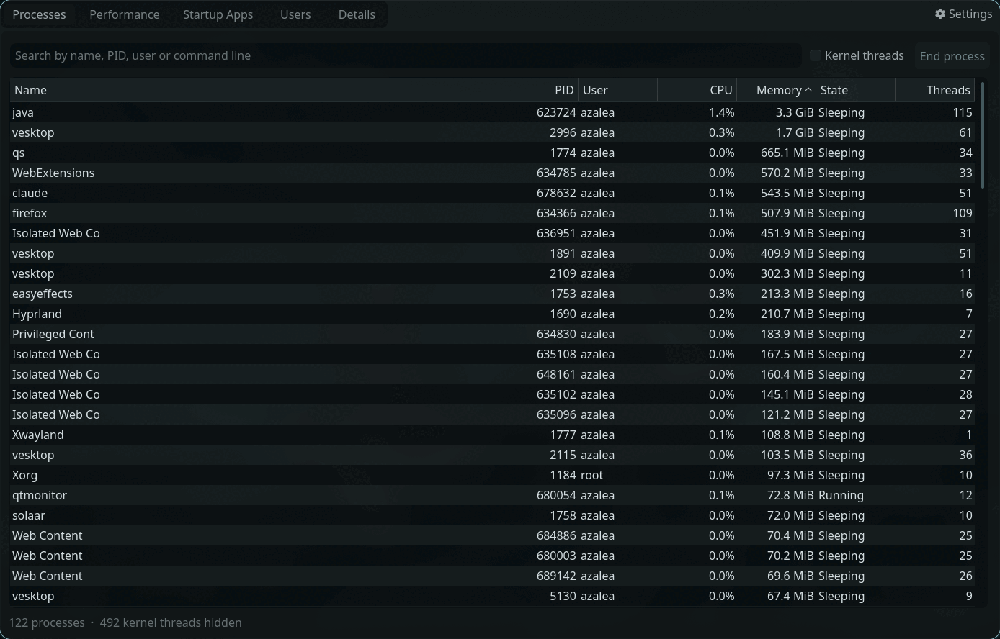
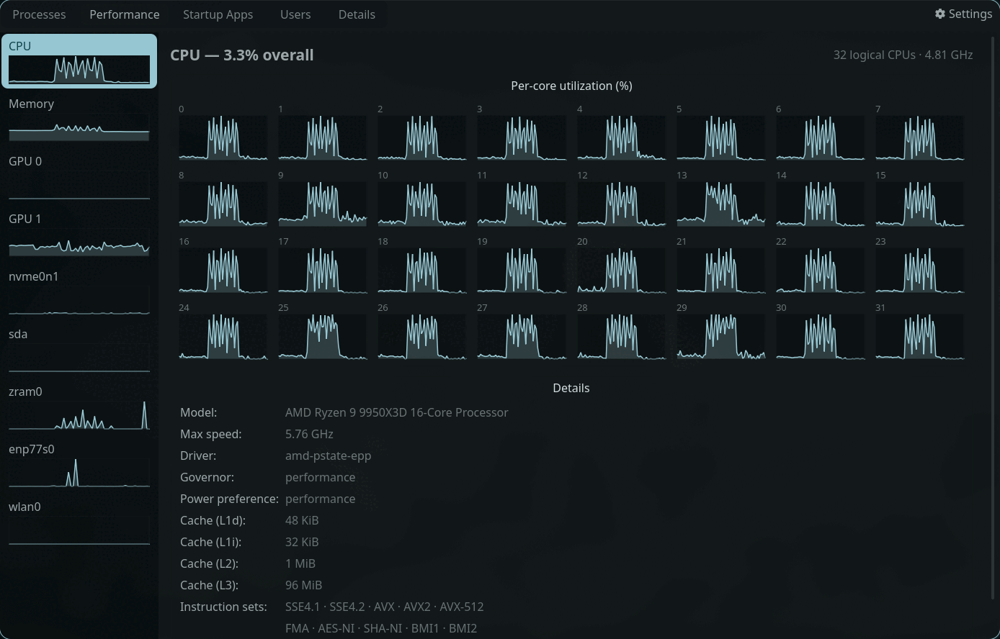
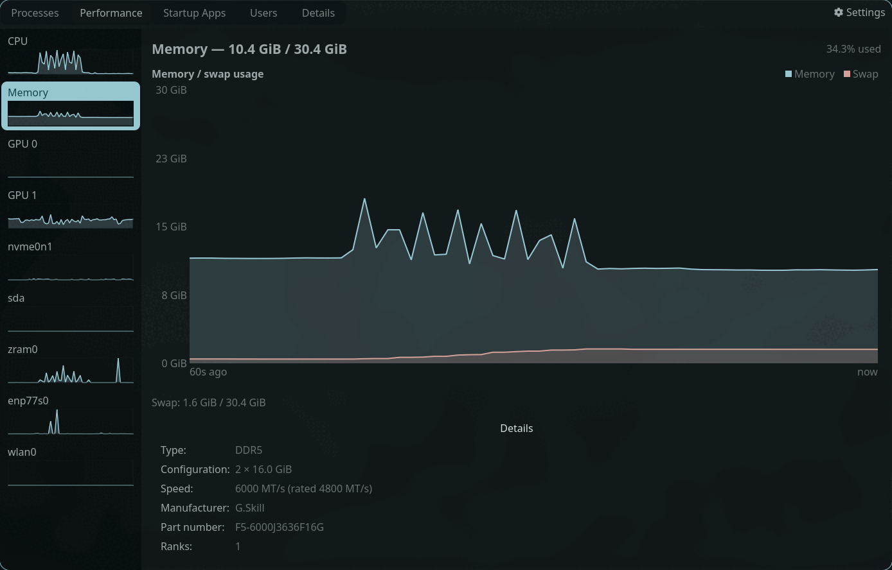
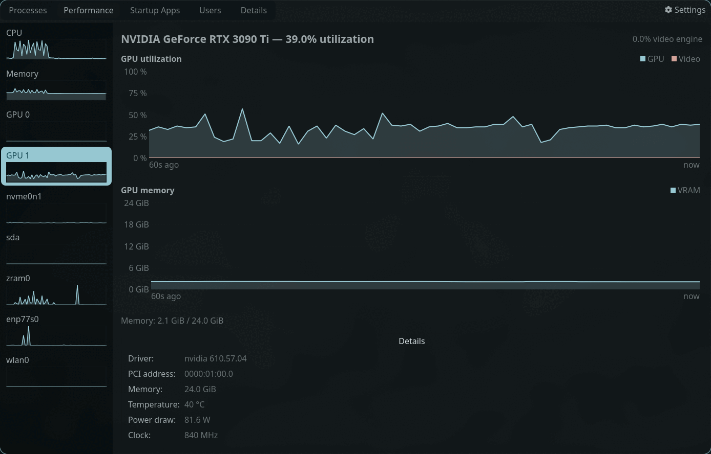
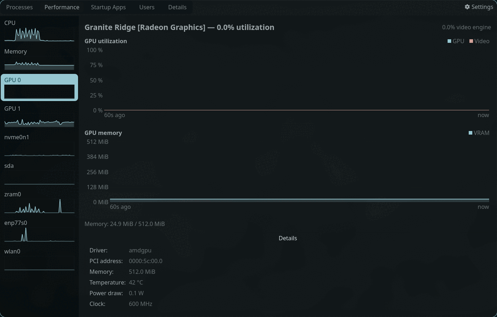
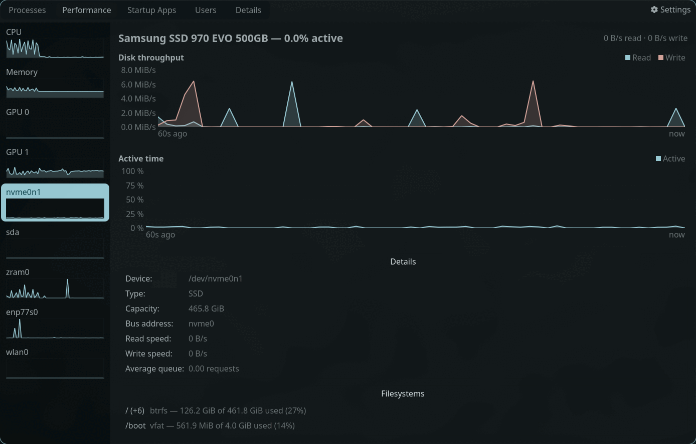
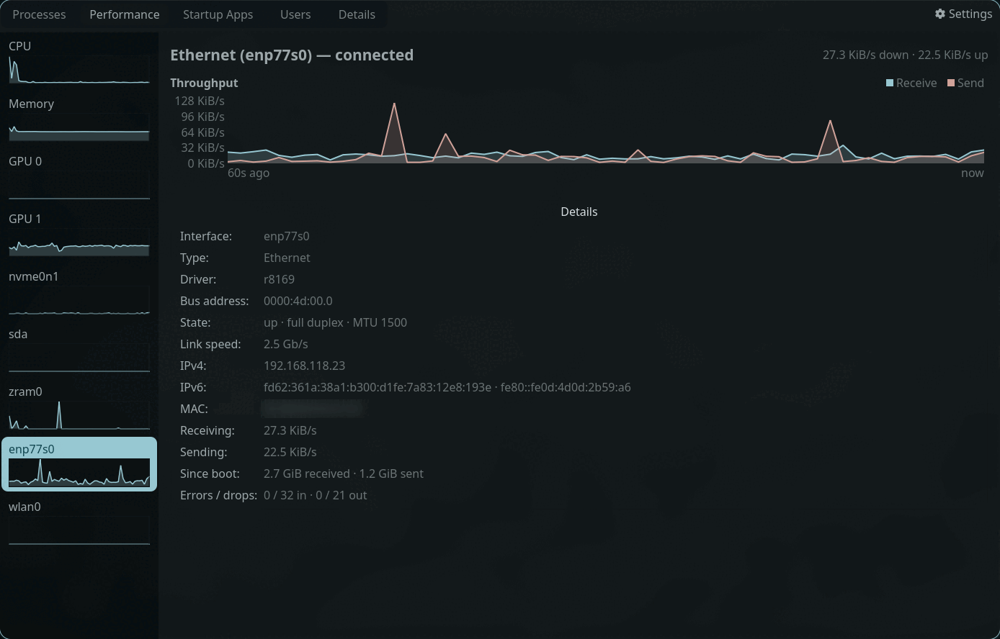
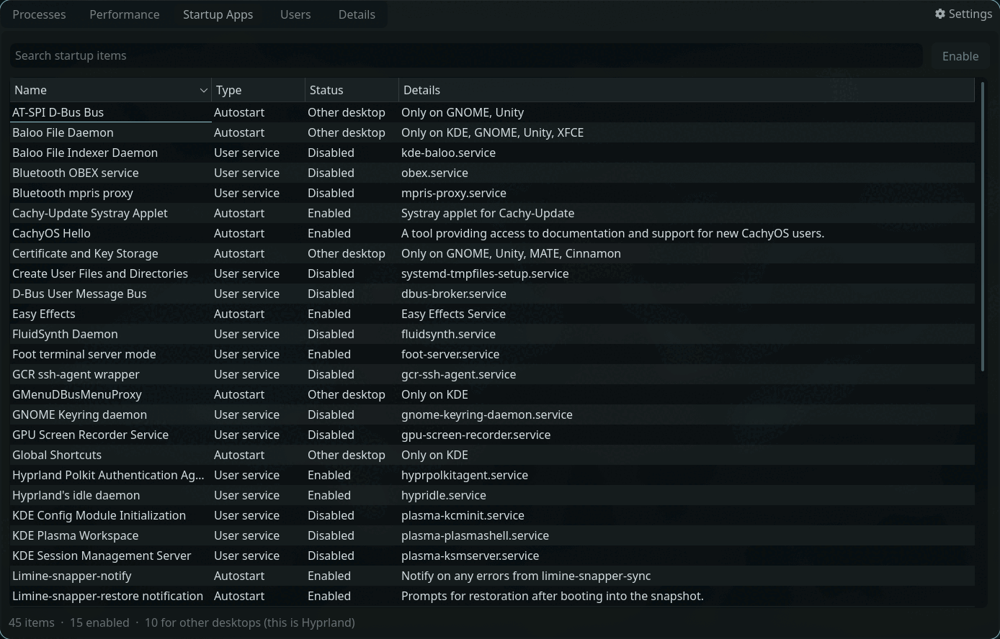
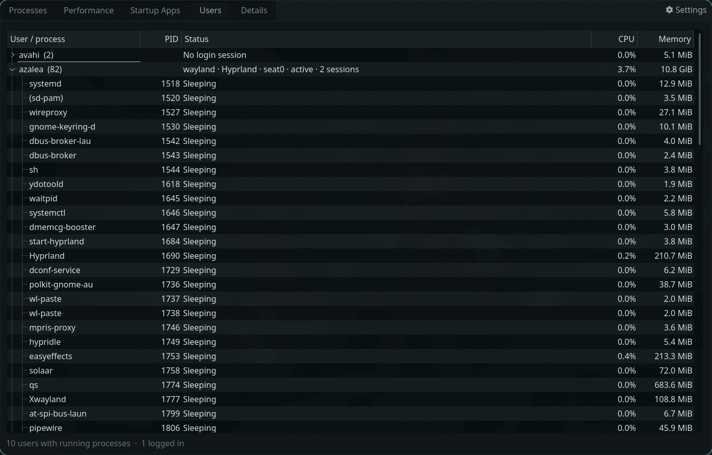
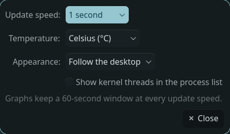

# Qtmonitor

A Qt6/KF6 resource and task monitor for Linux — the clear, at-a-glance layout
Windows Task Manager is known for, delivered as a Linux-native tool. Targets
Arch Linux and runs correctly on any desktop environment or window manager
(Plasma, GNOME, LXQt, Hyprland, Niri, sway, ...).



*Every screenshot here was taken on Hyprland with a dark palette. Qtmonitor
paints itself from whatever palette your desktop supplies — nothing about the
look is Plasma-, GNOME- or Hyprland-specific.*

## Status

Early development, but the four working tabs are complete and usable. The
fifth (Details) is still a placeholder. See "Features" for what exists today.

## Features

### Processes

A live process table fed from `/proc`, updated on the configured interval and
only while the tab is visible.

- Columns shown by default: Name, PID, User, CPU, Memory, State, Threads.
  Nice, Disk read, Disk write, GPU, GPU video and Command line can be added
  from the column header's right-click menu; column widths, order, visibility
  and sort order all persist between runs.
- **CPU% is share of total capacity, Task Manager style** — one fully busy
  core on a 32-thread machine reads about 3.1%, not 100%.
- Search box, and a toggle for kernel threads.
- **End process** sends SIGTERM, then offers SIGKILL if the process is still
  alive a few seconds later. Real signal names, not a euphemism. A zombie is
  detected and explained rather than being pointlessly SIGKILLed.
- Ending another user's or a root-owned process raises polkit's own
  authentication dialog (see "Privileged actions").
- Values that genuinely cannot be read — `/proc/PID/io` for another user's
  process, GPU usage on a card with no per-process source — show `—` rather
  than a misleading `0`.

### Performance

A resource sidebar — CPU, Memory, one row per GPU, per disk and per network
interface — with a page for each, every sidebar row carrying a live sparkline.



- **CPU**: overall utilization and current clock in the header, a per-core
  grid of small graphs below, and a details block with the model, maximum
  clock, scaling driver, current governor and energy-performance preference
  (both re-read every tick), cache sizes per level, and the notable
  instruction-set extensions.
- **Memory**: a RAM/swap history chart in GiB scaled to installed memory,
  plus in-use/available/cached figures and the per-slot DIMM inventory —
  size, type, configured *and* rated speed, part number and manufacturer.
- **GPU**: utilization and video-engine graphs, a VRAM chart, and live
  temperature, power draw and clock. One page per card.
- **Drives**: read and write throughput on one chart, **active time** on
  another — the share of the interval the device had requests outstanding,
  which is the figure that says whether the disk is the bottleneck, and is
  deliberately not the same thing as throughput. Below them: the model,
  capacity, bus address, live speeds and average queue depth, and the
  filesystems on that disk with their usage. One page per block device.
- **Network**: receive and send throughput, link state, negotiated speed,
  duplex, MTU, IPv4/IPv6/MAC addresses, since-boot totals and error and drop
  counts. One page per interface.

The throughput charts have no fixed ceiling — a disk's rated speed is
marketing and a 2.5 Gb/s link would leave ordinary traffic invisible — so
their axis follows the data and labels itself in absolute units.

All graphs are custom-painted widgets; there is intentionally no
`qt6-charts` dependency. They keep a fixed 60-second window at any update
speed, and re-derive their colors from the active palette.

Drive and network data is only sampled while the Performance tab is on
screen, the same rule the process list follows.

<details>
<summary><b>The other Performance pages</b> — memory, GPU, drives, network</summary>



*Memory: RAM and swap over the last 60 seconds, scaled to installed memory,
with the per-slot DIMM inventory below.*





*Both cards in the same machine: the NVIDIA card measured through
`nvidia-smi`, the AMD integrated GPU straight from sysfs. Each is detected
once and read by whichever backend can actually see it.*



*Drives: throughput and active time are separate charts, because a disk can
be saturated at a low transfer rate. The filesystems on the device are listed
underneath.*



*Network: throughput with a self-scaling axis, plus link state, negotiated
speed, addresses, since-boot totals and error counts. (The MAC address is
blurred in this screenshot only.)*

</details>

### Startup Apps

Everything that starts with your session, from both mechanisms that matter on
a modern Linux desktop, in one list:

- XDG autostart `.desktop` entries, with per-user files layered over the
  system ones.
- systemd `--user` units that have an `[Install]` section.

Each entry can be enabled or disabled in place. Disabling a system-wide entry
never touches `/etc` — it writes a shadowing file into `~/.config/autostart`.
Entries restricted to a desktop you are not running (`OnlyShowIn=KDE` on
Hyprland, say) are listed and marked rather than hidden, because "installed
but will never fire" is worth seeing.



### Users

One row per user with their session summary — session type, desktop, seat,
active state, session count, straight from logind — and their aggregate CPU
and memory. Expand a row for that user's processes. Rows update in place, so
an expanded or collapsed user stays that way while the numbers tick.



### Details

Still a placeholder. The Processes tab's configurable columns already cover
what Windows' Details tab does, so this one is waiting on a distinct job.

## Dependencies

All packages are from the official Arch repositories. KF6 libraries are
packaged under their plain names (`kauth`, `kconfig`) — there is no `kf6-`
prefix in Arch package names.

### Required (build time)

| Package | Purpose |
|---|---|
| `cmake` | Build system |
| `ninja` (or `make`) | Build tool |
| `gcc` | C++17 compiler |
| `extra/qt6-base` | Qt6 Widgets, DBus and Network |
| `extra/qt6-tools` | `lupdate`/`lrelease` for the translation catalogs |
| `extra/kauth` | Privileged actions via polkit (KAuth) |
| `extra/kconfig` | Settings storage (KConfig) |

Qt6 DBus and Qt6 Network both ship inside `qt6-base`, so reading logind
sessions and network interface addresses adds no package of its own. There is intentionally **no** `qt6-charts` dependency.

### Optional (runtime, auto-detected)

Qtmonitor probes for these at startup with `QStandardPaths::findExecutable`.
If a tool is missing, the corresponding UI section is hidden with an inline
hint — never a crash or blank panel. Running with none of them installed is a
supported, first-class configuration.

| Package | Enables |
|---|---|
| `nvidia-utils` | NVIDIA GPU stats via `nvidia-smi` (AMD/Intel need nothing) |
| `hwdata` | GPU model names from `pci.ids`; without it cards are named by vendor |
| `systemd` | The systemd half of the Startup Apps tab; without it, XDG autostart entries are still listed |
| `lm_sensors` | Nothing yet — registered for a future CPU/system temperature page. The temperatures shown today come from the GPU backends and need no extra tool. |

DIMM details come from the udev hardware database, which extracts them from
DMI at boot, so no `dmidecode` and no root is needed on systemd 255 or newer.

### GPU monitoring

AMD and Intel cards are read straight from `/sys/class/drm` and the kernel's
DRM fdinfo interface, with no optional tool required. NVIDIA's proprietary
driver publishes neither, so those cards need `nvidia-utils`; a card without
it still gets its own page, listing what sysfs knows plus the reason the
graphs are empty. Machines with cards from both vendors work — each is
detected once and measured by whichever backend can actually see it.

The per-process **GPU** and **GPU video** columns are off by default —
enable them from the column header's right-click menu. On AMD and Intel they
cover your own processes, the same limit the disk columns have, since
`/proc/PID/fdinfo` is unreadable for other users; processes that cannot be
measured show `—` rather than a misleading `0%`. The NVIDIA path reports
every process regardless of owner.

### Drive and network monitoring

Both read the kernel directly — `/proc/diskstats`, `/proc/net/dev`,
`/sys/block` and `/sys/class/net` — and need no optional tool and no
elevation.

Every whole block device the kernel reports gets a page, `zram` included;
partitions do not, since their I/O is already counted in their disk's. A
filesystem mounted at several paths, as a btrfs subvolume layout is, appears
once with its extra mount points listed in the row's tooltip, rather than as
one repeated row per path. Only mounts backed by a real `/dev` node are
listed: a network or FUSE mount cannot be attributed to local hardware, and
`statvfs()` on an unresponsive server would hang the interface.

Network interfaces backed by real hardware always get a page. Loopback never
does, and neither do the interfaces container and virtualisation stacks
create by the dozen (`veth*`, `docker*`, `br-*`, `virbr*`, and similar) —
but a tunnel, bridge or bond you set up yourself (`wg0`, `tun0`, `bond0`)
does, because somebody chose to create it.

## Settings

The gear button at the right-hand end of the tab bar opens a small preferences
dialog. It is modeless and has no OK button: every change applies live and is
saved immediately to `~/.config/qtmonitorrc`.



| Setting | Options |
|---|---|
| Update speed | 0.5 / 1 / 2 / 5 seconds (any value from 250 ms to 10 s is accepted in the config file) |
| Temperature | Celsius or Fahrenheit |
| Appearance | Follow the desktop, Light, or Dark |
| Kernel threads | Show or hide them in the process list |

Changing the update speed does not shrink the graphs' time span: they keep a
60-second window and re-scale, so the axis labels stay honest. The Light and
Dark options set an explicit palette rather than only a style hint, because a
platform theme that supplies its own palette ignores the hint. "Follow the
desktop" restores the palette the desktop supplied at startup; a system-wide
light/dark switch made after an override is picked up on the next launch.

## Build

```bash
cmake -B build -G Ninja
cmake --build build
./build/qtmonitor
```

Running from the build directory works fully, except that signalling another
user's process reports that the privileged helper is not installed.

### Install

```bash
cmake -B build -G Ninja -DCMAKE_INSTALL_PREFIX=/usr
cmake --build build
sudo cmake --install build
```

**The prefix must be `/usr`.** polkit and the D-Bus system bus read policy
only from `/usr` and `/etc`, so any other prefix scatters the privileged
helper away from its policy file and escalation silently stops working. CMake
warns at configure time if the prefix is something else.

Installing places the binary in `/usr/bin`, the desktop entry in
`/usr/share/applications`, the AppStream metadata in `/usr/share/metainfo`,
the application icon in the hicolor theme, and the KAuth helper plus its
polkit action and D-Bus files where the system bus expects them.

### Tests

The `/proc` and `/sys` parsers are covered by fixture-based tests. Every
provider takes a filesystem root that is prepended to the paths it reads —
empty in the application, and a temporary directory seeded from
`tests/fixtures/` under test — so the parsing and the rate arithmetic run
against known input on any machine.

```bash
cmake -B build -G Ninja -DQTMONITOR_BUILD_TESTS=ON
cmake --build build
ctest --test-dir build --output-on-failure
```

Tests are off by default, so an ordinary or packaged build needs neither
`qt6-base`'s Test module nor ctest.

What they pin down is the delta arithmetic: a rate is a counter difference
divided by elapsed time, and a wrong divisor, an unhandled counter reset or
an off-by-one in a column index all still produce a number that looks
entirely plausible on a graph. Each case asserts an exact expected value —
1 MiB/s, 25% active, a queue depth of 1.5 — computed by hand from the
fixture. The interval is supplied to the provider rather than measured, so
no assertion depends on how long the test process was scheduled out for.

Deliberately not covered: the filesystem list on the Drives page, which calls
`statvfs()` on real mount points and so cannot be driven from a fixture tree,
and the GPU provider's per-process fdinfo walk, which uses `opendir()` on
`/proc` directly. GPU *discovery* is covered.

### Translations

Every user-facing string goes through `tr()`, and the catalogs live in
`translations/`. `qtmonitor_en.ts` is the source-language template; the
compiled `.qm` files are embedded in the binary under `:/i18n`, so a
translated build is still a single file with no runtime lookup path.

To refresh the catalogs after changing or adding strings:

```bash
cmake --build build --target update_translations
```

To start a new language, copy the template and hand it to Linguist:

```bash
cp translations/qtmonitor_en.ts translations/qtmonitor_de.ts
```

then add it to `TS_FILES` in `CMakeLists.txt`. The language is chosen from
the system locale at startup; a locale with no catalog falls back to English,
which is the source language and always complete.

Qt's own strings — the buttons in the confirmation dialogs — come from the
`qtbase` catalog that ships with Qt, loaded alongside ours.

The privileged helper is deliberately left untranslated. It runs as root
under D-Bus activation, where the invoking user's locale is not part of the
environment, so its handful of refusal strings would be translated to the
wrong language as often as the right one.

## Design notes

- Core metrics (CPU, memory, swap, disk I/O, network I/O, process list, GPU)
  are read directly from `/proc` and `/sys` — no system monitor daemon
  required, and no polling of anything that needs elevation.
- Theming follows Qt's active platform theme and the system palette; no
  Breeze or Plasma assumption anywhere. The manual dark/light override is an
  explicit `QPalette`, applied application-wide including the graphs.
- Icons resolve through `QIcon::fromTheme()` with bundled fallbacks, so the
  app looks correct under any icon theme.
- Nothing here assumes Plasma is running. KF6 is used strictly as a set of
  libraries; there is no KSysGuard, no Plasma applet, and no KNotification.

### Privileged actions

Ending a process you own needs no elevation and never asks. Only when the
plain `kill()` comes back EPERM — another user's process, or root's — does
Qtmonitor escalate, through KAuth and polkit's standard authentication
dialog. There is no second confirmation dialog of our own; polkit's *is* the
confirmation.

The privileged part is a separate minimal binary (`qtmonitor_helper`,
action id `org.qtmonitor.signalprocess`) that links no GUI code. Because it
runs as root, it treats every argument as hostile: it refuses PID 1 and any
non-positive PID, accepts an enum for *terminate* or *kill* rather than a
signal number so no arbitrary signal can be smuggled through, and re-checks
the target's start time before signalling, which defeats PID reuse between
the click and the call.

## Continuous integration

`.github/workflows/ci.yml` runs on Arch rather than on `ubuntu-latest` with a
backported Qt, because Arch is what the app is installed into and a green
build against an older Qt would prove nothing. Three jobs: build and test;
validate the desktop entry and the AppStream metadata; and regenerate the
translation catalog and fail if it differs from what is committed.

The build job also installs to a staging root and asserts that the binary,
desktop entry, metainfo and icon all landed — a plain build would not have
caught the icon that `cmake --install` used to omit.

## License

GPL-3.0. See [LICENSE](LICENSE).
